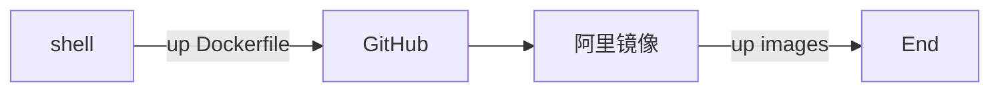

# kubernetes images


## docker-k8s.gcr.io
```
k8s.gcr.io/kube-apiserver:v1.18.5  
k8s.gcr.io/kube-controller-manager:v1.18.5  
k8s.gcr.io/kube-scheduler:v1.18.5  
k8s.gcr.io/kube-proxy:v1.18.5  
k8s.gcr.io/pause:3.2  
k8s.gcr.io/etcd:3.4.3-0  
k8s.gcr.io/coredns:1.6.7
kubernetesui/dashboard:v2.0.3
kubernetesui/metrics-scraper:v1.0.4
quay.io/coreos/flannel:v0.12.0-amd64
calico/cni:v3.15.1
calico/pod2daemon-flexvol:v3.15.1
calico/node:v3.15.1
calico/kube-controllers:v3.15.1
```
### docker pull images
```
docker pull registry.cn-shenzhen.aliyuncs.com/grc/kube-apiserver:v1.18.5
docker pull registry.cn-shenzhen.aliyuncs.com/grc/kube-controller-manager:v1.18.5
docker pull registry.cn-shenzhen.aliyuncs.com/grc/kube-scheduler:v1.18.5
docker pull registry.cn-shenzhen.aliyuncs.com/grc/kube-proxy:v1.18.5
docker pull registry.cn-shenzhen.aliyuncs.com/grc/pause:3.2
docker pull registry.cn-shenzhen.aliyuncs.com/grc/etcd:3.4.3-0
docker pull registry.cn-shenzhen.aliyuncs.com/grc/coredns:1.6.7
docker pull registry.cn-shenzhen.aliyuncs.com/grc/flannel:v0.12.0-amd64
```

### docker tag images
```
docker tag registry.cn-shenzhen.aliyuncs.com/grc/kube-apiserver:v1.18.5 k8s.gcr.io/kube-apiserver:v1.18.5
docker tag registry.cn-shenzhen.aliyuncs.com/grc/kube-controller-manager:v1.18.5 k8s.gcr.io/kube-controller-manager:v1.18.5
docker tag registry.cn-shenzhen.aliyuncs.com/grc/kube-scheduler:v1.18.5 k8s.gcr.io/kube-scheduler:v1.18.5
docker tag registry.cn-shenzhen.aliyuncs.com/grc/kube-proxy:v1.18.5 k8s.gcr.io/kube-proxy:v1.18.5
docker tag registry.cn-shenzhen.aliyuncs.com/grc/pause:3.2 k8s.gcr.io/pause:3.2
docker tag registry.cn-shenzhen.aliyuncs.com/grc/etcd:3.4.3-0 k8s.gcr.io/etcd:3.4.3-0
docker tag registry.cn-shenzhen.aliyuncs.com/grc/coredns:1.6.7 k8s.gcr.io/coredns:1.6.7
docker tag registry.cn-shenzhen.aliyuncs.com/grc/flannel:v0.11.0-amd64 quay.io/coreos/flannel:v0.12.0-amd64
```

### shell auto
```
images=(
    kube-apiserver:v1.18.5
    kube-controller-manager:v1.18.5
    kube-scheduler:v1.18.5
    kube-proxy:v1.18.5
    pause:3.2
    etcd:3.4.3-0
    coredns:1.6.7
    kubernetes-dashboard-amd64:v1.10.1
)
for imageName in ${images[@]} ; do
    docker pull registry.cn-shenzhen.aliyuncs.com/grc/$imageName
    docker tag registry.cn-shenzhen.aliyuncs.com/grc/$imageName k8s.gcr.io/$imageName ; done
```
